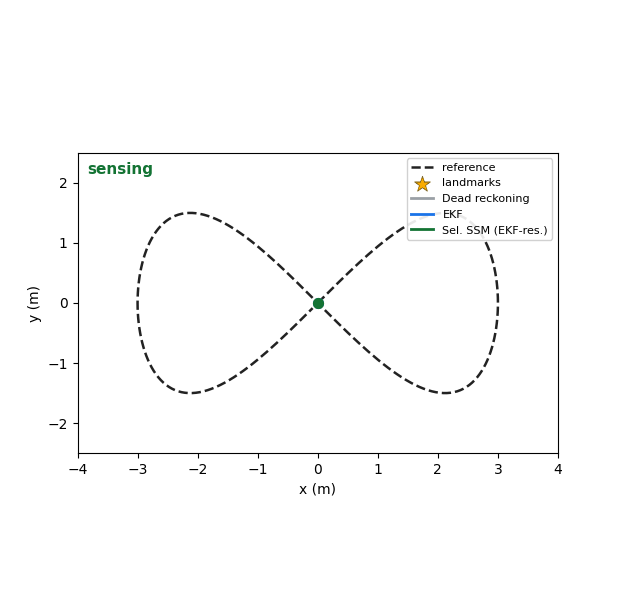
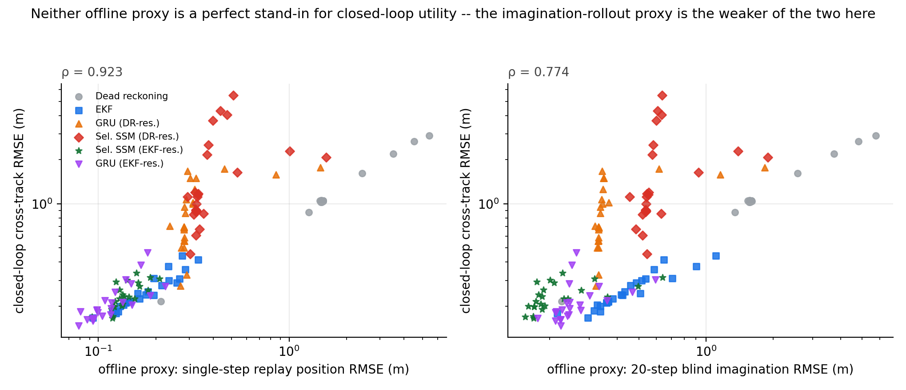

<h1 align="center">Feedback-Aware Robot World-Model Evaluation</h1>

<p align="center"><b>Do Better Imagined Rollouts Mean Better Robot Control?</b></p>

<div align="center">

[](paper/paper.pdf)
[](#reproduce-the-results)
[](requirements.txt)

</div>

<p align="center">
  
</p>

World models are often evaluated by how accurately they predict imagined futures. Robot control, however, is usually a feedback process: **predict, act, observe, correct, and replan**. This repository asks a simple question:

> **If a model is better at open-loop imagined rollouts, is it also better for closed-loop robot control?**

In this controlled testbed, the answer is **not necessarily**. We compare six predictive state models over 24 sensing conditions using three views of the same model: ordinary replay error, a 20-step measurement-free rollout, and closed-loop tracking error.

<p align="center">
  
</p>

## Main result

| Offline model-selection score | Spearman correlation with closed-loop error | Wrong winner | Max regret |
|---|---:|---:|---:|
| **Replay position RMSE** | **0.923** | **5 / 24** | **0.0347 m** |
| Replay heading RMSE | 0.881 | 19 / 24 | 0.0474 m |
| 20-step blind-rollout RMSE | 0.774 | 18 / 24 | 0.1208 m |

A longer rollout looks more like planning, but it is a worse deployment proxy here because deployment is not blind: the robot receives intermittent observations and repeatedly corrects its state estimate.

We also test whether training on longer blind intervals improves control. Under compound stress, the rollout curriculum helps the EKF-anchored models:

- **GRU-EKF:** 1.717 -> **1.061 m** cross-track RMSE (-38%)
- **SSM-EKF:** 1.936 -> **1.419 m** (-27%)
- **SSM-DR:** 5.290 -> **5.411 m** (+2%; no gain)

The same curriculum is not uniformly helpful under isolated blackout stress. In particular, SSM-EKF becomes worse across the tested blackout sweep.

## Why this matters for world-model evaluation

The result is not an argument against long-horizon prediction. It is an argument for **matching the evaluation protocol to the information pattern at deployment**. A rollout horizon by itself is incomplete: the benchmark should also specify when new observations arrive, when the world model is reconditioned, and when the controller replans.

This small system deliberately removes visual representation learning so that the relationship between prediction fidelity and downstream control can be measured directly and repeatedly.

## Paper

**Do Better Imagined Rollouts Mean Better Robot Control? A Controlled Study of World-Model Evaluation Under Feedback**  
Dharini Raghavan, Amritpal Singh  
NeurIPS 2026 Workshop on *Robot Learning with World Models: Capabilities, Frontiers, and Challenges*

- [Paper PDF](paper/paper.pdf)
- [LaTeX source](paper/main.tex)
- [Paper figures](paper/figures/)

## Repository structure

```text
.
├── assets/                       # demo GIF and tracking videos
├── docs/                         # compact result notes
├── paper/                        # workshop paper source, PDF, and figures
├── results/
│   ├── models/                   # baseline learned observers
│   ├── models_worldmodel/        # long-blackout curriculum checkpoints
│   ├── reference/                # audited baseline results
│   └── worldmodel/               # results used by the workshop paper
├── scripts/
│   ├── evaluate_worldmodel.py    # full workshop evaluation
│   ├── train_rollout_curriculum.py
│   ├── make_figures.py
│   └── verify_results.py         # checks headline paper claims
├── src/ssm_obs/                  # simulation, observers, control, metrics
├── tests/                        # unit tests
└── reproduce.sh                  # one-command reproduction entry point
```

The internal Python package keeps the original `ssm_obs` module name so that the released checkpoints and experiment scripts remain compatible.

## Installation

```bash
git clone https://github.com/rdharini2001/Selective-State-Space-Observers-for-Estimate-Driven-Robot-Control-Under-Intermittent-Sensing.git
cd Selective-State-Space-Observers-for-Estimate-Driven-Robot-Control-Under-Intermittent-Sensing

python -m venv .venv
source .venv/bin/activate
pip install -r requirements.txt
```

For the cleaned workshop package distributed with the submission, run the commands from its repository root.

## Reproduce the results

### 1. Verify the reported headline numbers

```bash
PYTHONPATH=src python scripts/verify_results.py
```

Expected output includes:

```text
All headline paper claims match the bundled result JSON files.
Replay rho: 0.923; blind-rollout rho: 0.774
Top-1 failures: 5/24 vs 18/24
GRU-EKF compound stress: 1.717 -> 1.061 m
SSM-EKF compound stress: 1.936 -> 1.419 m
```

### 2. Run the unit tests

```bash
pytest -q
```

### 3. Reproduce from bundled checkpoints/results

```bash
./reproduce.sh
```

### 4. Retrain the long-blackout curriculum models

```bash
./reproduce.sh --retrain
```

### 5. Full rerun

```bash
./reproduce.sh --full
```

The full command retrains the curriculum models, reruns evaluation, regenerates figures, and attempts to rebuild the paper PDF. A standard TeX installation with BibTeX is required for the final paper-build step.

## Evaluation protocol

We compare the same predictive model under three information patterns:

1. **Replay:** logged motion and intermittent measurements are both available.
2. **Blind rollout:** the model is copied from a real trajectory and rolled forward for 20 steps without new landmark measurements.
3. **Closed loop:** the estimate drives the controller; future actions therefore depend on prediction error, while intermittent measurements continue to arrive.

The six core models are dead reckoning, EKF, GRU-DR, SSM-DR, GRU-EKF, and SSM-EKF. Evaluation spans 24 controlled sensing conditions and ten simulation seeds per condition.

## Key files

- [`src/ssm_obs/imagination.py`](src/ssm_obs/imagination.py): model-agnostic blind-rollout diagnostic.
- [`scripts/evaluate_worldmodel.py`](scripts/evaluate_worldmodel.py): closed-loop, replay, rollout, stress-sweep, and selection analysis.
- [`scripts/train_rollout_curriculum.py`](scripts/train_rollout_curriculum.py): long-blackout training experiment.
- [`results/worldmodel/proxy_with_imagination.json`](results/worldmodel/proxy_with_imagination.json): data behind the main proxy comparison.
- [`results/worldmodel/wm_compound.json`](results/worldmodel/wm_compound.json): compound-stress result.
- [`scripts/verify_results.py`](scripts/verify_results.py): direct checks of the paper's headline numerical claims.

## Citation

If this testbed or evaluation protocol is useful in your work, please cite the workshop paper:

```bibtex
@inproceedings{raghavan2026feedbackworldmodels,
  title     = {Do Better Imagined Rollouts Mean Better Robot Control? A Controlled Study of World-Model Evaluation Under Feedback},
  author    = {Raghavan, Dharini and Singh, Amritpal},
  booktitle = {NeurIPS Workshop on Robot Learning with World Models: Capabilities, Frontiers, and Challenges},
  year      = {2026}
}
```

## Acknowledgments

This work grew from a controlled robot state-estimation and control testbed developed at Georgia Tech and was extended with blind-rollout evaluation and long-blackout curriculum experiments for the NeurIPS 2026 world-model workshop submission.
